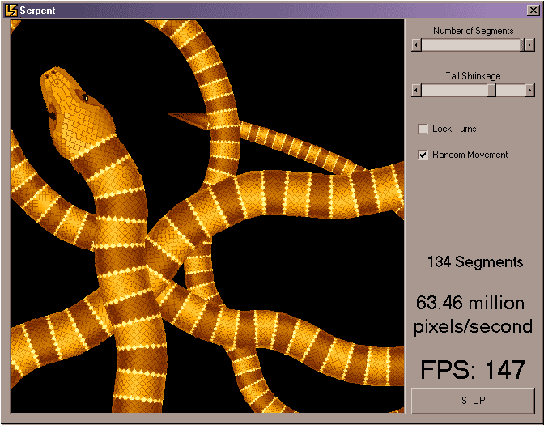



## A 200 segment slithering snake

### Description

Awesome screenshot! The fastest 2D bitmap scaled rotation on PSC!

Highly optimized fixed point math for incredible speed!

Please vote and send me your comments.

Extra keywords (fast faster rotation fixed-point fixedpoint serpent)
 
### More Info
 

             |
---                |---
**Submitted On**   |2006-12-18 20:51:10
**By**             |[Jason Bullen](https://github.com/Planet-Source-Code/PSCIndex/blob/master/ByAuthor/jason-bullen.md)
**Level**          |Intermediate
**User Rating**    |4.9 (143 globes from 29 users)
**Compatibility**  |VB 5\.0, VB 6\.0
**Category**       |[Graphics](https://github.com/Planet-Source-Code/PSCIndex/blob/master/ByCategory/graphics__1-46.md)
**World**          |[Visual Basic](https://github.com/Planet-Source-Code/PSCIndex/blob/master/ByWorld/visual-basic.md)
**Archive File**   |[A\_200\_segm204037122007\.zip](https://github.com/Planet-Source-Code/jason-bullen-a-200-segment-slithering-snake__1-67532/archive/master.zip)

